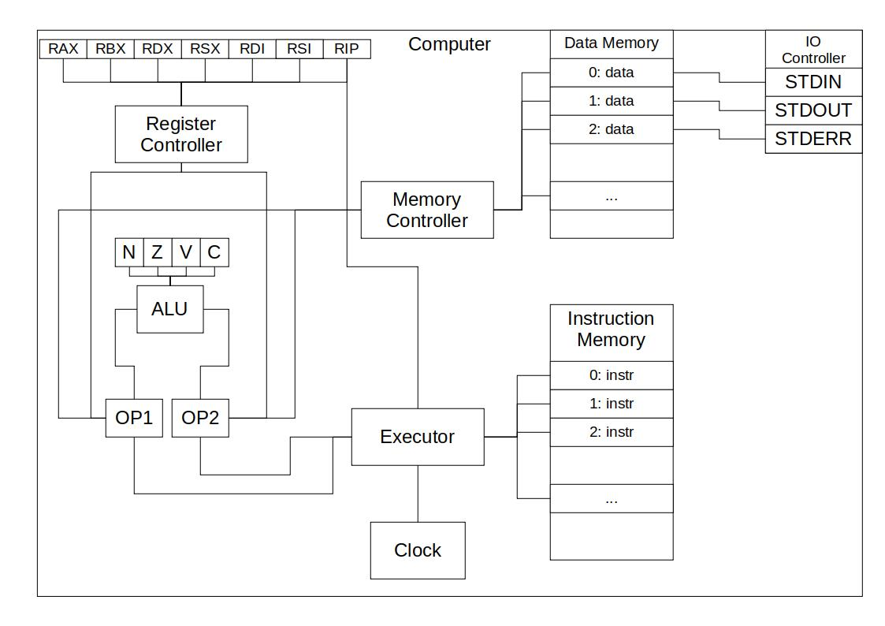

# Лабораторная работа №3. На кончиках пальцев

## Цель

- экспериментальное знакомство с устройством процессоров через моделирование; 
- получение опыта работы с компьютерной системой на нескольких уровнях организации.

### Выполнил
ФИО: Харламов Александр Сергеевич<br>
Группа: P33102

### Вариант

`asm | cisc | harv | hw | tick | struct | stream | mem | prob5`

- ЯП. Синтаксис: **asm**
  - Синтаксис ассемблера
  - Необходима поддержка label-ов
- Архитектура: **cisc**
  - Система команд должна содержать сложные инструкции переменной длины и разрешающие адресацию как регистров, так и памяти
- Организация памяти: **harv**
  - Гарвардская архитектура
- Control Unit: **hw** 
  - hardwided
  - Реализуется как часть модели
- Точность модели: **tick**
  - Процессор необходимо моделировать с точности до такта
- Представление машинного кода: **struct**
  - В виде высокоуровневой структуры данных
  - Считается, что одна инструкция укладывается в одно машинное слово, за исключением CISC архитектур
  - **ПРИМЕЧАНИЕ**. Транслятор переводит исходный код в класс `Program`, который затем сериализуется в бинарный вид. Компьютер использует десериализованный класс `Program`.
- Ввод-вывод: **stream**
  - Осуществляется как поток токенов.
  - Ввод - считали значение, упортребили токен.
- Ввод-вывод ISA: **mem**
  - Поддержка ввода-вывода с точки зрения системы команд
  - memory-mapped
- Алгоритм: **prob5**
  - Входные данные должны подаваться через ввод
  - Результат должен быть подан на вывод
  - Формат ввода/вывода данных - на ваше усмотрение

## Установка и запуск

```shell
$ git clone https://gitlab.se.ifmo.ru/wignorbo/py_asm.git
$ cd py_asm
$ pip install poetry
$ poetry install --no-root
```

```shell
$ python main.py --help

 Usage: main.py [OPTIONS] COMMAND [ARGS]...

 PyAsm Runner

╭─ Options ────────────────────────────────────────────────────────────────────────────────────────────────────╮
│ --install-completion          Install completion for the current shell.                                      │
│ --show-completion             Show completion for the current shell, to copy it or customize the             │
│                               installation.                                                                  │
│ --help                        Show this message and exit.                                                    │
╰──────────────────────────────────────────────────────────────────────────────────────────────────────────────╯
╭─ Commands ───────────────────────────────────────────────────────────────────────────────────────────────────╮
│ exec                     Execute object file                                                                 │
│ run                      Translate and execute .pyasm file                                                   │
│ translate                Translate .asm code to object file                                                  │
╰──────────────────────────────────────────────────────────────────────────────────────────────────────────────╯
```

### Трансляция

```
$ python .\main.py translate --help

 Usage: main.py translate [OPTIONS] ASM_FILE_NAME

 Translate .asm code to object file

╭─ Arguments ──────────────────────────────────────────────────────────────────────────────────────────────────╮
│ *    asm_file_name      TEXT  [default: None] [required]                                                     │
╰──────────────────────────────────────────────────────────────────────────────────────────────────────────────╯
╭─ Options ────────────────────────────────────────────────────────────────────────────────────────────────────╮
│ --output   -o      TEXT  [default: None]                                                                     │
│ --verbose  -v                                                                                                │
│ --help                   Show this message and exit.                                                         │
╰──────────────────────────────────────────────────────────────────────────────────────────────────────────────╯
```

### Исполнение

```shell
$ python .\main.py exec --help     

 Usage: main.py exec [OPTIONS] OBJ_FILE_NAME

 Execute object file

╭─ Arguments ──────────────────────────────────────────────────────────────────────────────────────────────────╮
│ *    obj_file_name      TEXT  [default: None] [required]                                                     │
╰──────────────────────────────────────────────────────────────────────────────────────────────────────────────╯
╭─ Options ────────────────────────────────────────────────────────────────────────────────────────────────────╮
│ --trace  -t      [no|tick|inst]  [default: Trace.NO]                                                         │
│ --help                           Show this message and exit.                                                 │
╰──────────────────────────────────────────────────────────────────────────────────────────────────────────────╯
```

### Трансляция + Исполнение

```shell
$ python .\main.py run --help 

 Usage: main.py run [OPTIONS] ASM_FILE_NAME

 Translate and execute .pyasm file

╭─ Arguments ──────────────────────────────────────────────────────────────────────────────────────────────────╮
│ *    asm_file_name      TEXT  [default: None] [required]                                                     │
╰──────────────────────────────────────────────────────────────────────────────────────────────────────────────╯
╭─ Options ────────────────────────────────────────────────────────────────────────────────────────────────────╮
│ --output   -o      TEXT            [default: None]                                                           │
│ --verbose  -v                                                                                                │
│ --trace    -t      [no|tick|inst]  [default: Trace.NO]                                                       │
│ --help                             Show this message and exit.                                               │
╰──────────────────────────────────────────────────────────────────────────────────────────────────────────────╯
```

## Язык программирования

### Структура программы

```
; секция данных
section .data
    var: (STR) | (NUM) | (buf NUM)

; секция кода
section .text
    [label:] instr [op1, [op2, [...]]]
```

### Секция данных

```
section .data
    HELLO:      "Hello"         ; строка
    NUMBER_HEX: 0xDEAD          ; число в 16 СС
    NUMBER_OCT: 0o1337          ; число в 8 СС
    NUMBER_BIN: 0b10110         ; число в 2 СС
    NUMBER_DEC: -81             ; число в 10 СС
    ARRAY:      buf 20          ; массив из 20 элементов
    NULL_TERM:  0x00
```

### Секция кода

```
section .text
    .print_char:                        ; метка
        MOV %rdx, #ARRAY[%rdi]          ; загрузить
                                        ; в регистр RDX
                                        ; значение ARRAY[RDI]
                                        ; (косвенная адресация) 
        
        CMP %rdx, #NULL_TERM            ; сравнить
                                        ; регистр RDX
                                        ; и переменную
                                        ; (прямая адресация)

        JE .exit                        ; если равны
                                        ; прыгаем на .exit

        MOV #STDOUT, %rdx               ; выводим символ
                                        ; из регистра RDX

        INC %rdi                        ; инкрементируем
                                        ; регистр RDI
        
        JMP .print_char                 ; прыгаем на .print_char
    
    .exit:
        HLT                             ; завершение программы
```

### Инструкции

Главная особенность - принятие неограниченного количества операндов.

```
ADD %RAX, #VAR              ; %RAX + #VAR        -> %RAX
ADD %RAX, #VAR, 0xf1        ; #VAR + 0xf1        -> %RAX
ADD %RAX, #VAR, 0xf1, %RDX  ; #VAR + 0xf1 + %RDX -> %RAX
```

На этапе трансляции сложная инструкция преобразуется в несколько простых.

[Полный список инструкций](docs/instructions.md)

### Операнды

#### Константа

Целое число. На этапе трансляции символ преобразовывается в unicode.

Является read-only, не может быть приёмником.

```
ADD %rax, 1, 0x12, 'h';     1 + 0x12 + ord('h') -> %rax
```

#### Регистр

Всего их семь: RAX, RBX, RDX, RSX, RIP, RSI, RDI.

Обращение происходит через знак процента. Не зависит от регистра.

```
XOR %rdx, %RDX;
```

#### Метка

```
    ...
    JMP .exit
    ...
.exit:
    ...
```

#### Адрес

Обращение к данным с помощью решетки и названия переменной.

##### Прямая адресация

```
INC #VAR
```

##### Косвенная адресация

```
INC #ARR[2]
```

В качестве индекса может выступать константа или регистр.


### Стратегия вычислений

Вызов по адресу. Доступ к переменной производится через адрес, непосредственно указывающий на ячейку памяти, в которой она находится.

### Типизация

- Статическая. Ошибки выявляются на стадии трансляции
- Слабая. Строки в unicode-числа конвертируются автоматически

## Организация памяти

### Память данных

Всего доступно `MEMORY_SIZE` ячеек памяти, машинное слово - `N_BITS`. Значения задаются в `core/machine/config.py`, по умолчанию они 128 и 32 соответственно.

На этапе трансляции все константы преобразовываются в числа. Символы - в число, строка - в массив чисел.

```
A: 1        -> [1]
B: 'hello'  -> [104, 101, 108, 108, 111]
C: buf 4    -> [0, 0, 0, 0]
```

Данные располагаются последовательно, тогда настоящие адреса у переменных A, B, C будут такие: 0, 1, 6.

Доступ к переменным происходит через решетку:

```
#A      ; 1     (прямая адресация)
#B[2]   ; 108   (косвенная адресация)
#C      ; 0     (прямая адресация, первый элемент)
```

Блок памяти создается на этапе трансляции, поэтому при запуске программы нужно просто загрузить этот "контейнер" с данными.

### Память инструкций

Представляет собой список инструкций. Программа начинает работу с самой первой. Заканчивает последней инструкцией или инструкцией HLT.

На этапе трансляции они получают адреса, метки конвертируются в эти же адреса. Помимо меток инструкции больше никак не адресуются, поэтому нельзя получить доступ к предыдущей.

## Система команд

Инструкция представляет собой дата-класс, содержащий имя и список операндов.

Главная особенность - принятие неограниченного количества операндов.

```
ADD %RAX, #VAR              ; %RAX + #VAR        -> %RAX
ADD %RAX, #VAR, 0xf1        ; #VAR + 0xf1        -> %RAX
ADD %RAX, #VAR, 0xf1, %RDX  ; #VAR + 0xf1 + %RDX -> %RAX
```

[Полный список инструкций](docs/instructions.md)

Инструкции DIV и MOD вызывают прерывания при попытке деления на нуль, HLT вызывает прерывание при ее вызове. Реализовано с помощью собственного класса PyAsmException. 

Внутренние ошибки обрабатываются контекстным менеджером, который отлавливает их и преобразовывает в PyAsmException, поэтому пользователь лишнего не узнает.

## Транслятор

Имеет две стадии:

- Предобработка
    - Удаление лишних символов (пробелов, табуляций)
    - Удаление комментариев
- Трансляция
  - Текст -> секции
  - Секция -> строчки
  - Строчка -> метка, инструкция
  - Инструкция -> команда, операнды
  - Операнд -> константа, регистр, адрес, метка

На языке моделей дерева:

```
Program:
    - DataSection
    - CodeSection
        - Instruction[]
            - Operand[]
            - Instruction[]
```

Сам парсинг и валидация происходят с помощью регулярных выражений и обычных преобразований со строками.

Если явно не указать имя объектного файла, то появится файл prob5.pyasm.o, который содержит сериализованное с помощью модуля `pickle` дерево. Весит намного меньше обычного JSON.

Как выглядит изначальный код:

```text
section .data
    NULL_TERM: 0x00
    HELLO: "hello world"

section .text
    .print_char:
        MOV %rdx, #HELLO[%rdi]
        CMP %rdx, #NULL_TERM
        JE .exit
        MOV #STDOUT, %rdx
        INC %rdi
        JMP .print_char
    .exit:
        HLT
```

Как выглядит объектный файл после трансляции:

```python
>>> from pprint import pprint
>>> program = read_program_from_file('../test/examples/prob5.pyasm.o')
>>> pprint(program)
Program(data=DataSection(var_to_addr={'MAX_DIVIDER': 3,
                                      'STDERR': 2,
                                      'STDIN': 0,
                                      'STDOUT': 1,
                                      'STEP': 4},
                         memory=[0, 0, 0, 20, 2]),
        text=TextSection(labels={'.check_mod': 7,
                                 '.exit': 24,
                                 '.find_number': 15,
                                 '.find_prime': 3,
                                 '.mul_step': 13,
                                 '.next_divider': 18,
                                 '.next_number': 16},
                         lines=[Instruction(name='xor',
                                            operands=[Register(name='RAX'),
                                                      Register(name='RAX')],
                                            sub=[Instruction(name='xor',
                                                             operands=[Register(name='RAX'),
                                                                       Register(name='RAX')],
                                                             sub=[])]),
                                Instruction(name='ldn',
                                            operands=[Address(value=3,
                                                              label='MAX_DIVIDER'),
                                                      Address(value=0,
                                                              label='STDIN')],
                                            sub=[]),
                                Instruction(name='mov',
                                            operands=[Register(name='RAX'),
                                                      Address(value=4,
                                                              label='STEP')],
                                            sub=[]),
                                Instruction(name='inc',
                                            operands=[Register(name='RAX')],
                                            sub=[]),
                                Instruction(name='cmp',
                                            operands=[Register(name='RAX'),
                                                      Address(value=3,
                                                              label='MAX_DIVIDER')],
                                            sub=[]),
                                Instruction(name='jg',
                                            operands=[Label(name='.find_number',
                                                            value=15)],
                                            sub=[]),
                                Instruction(name='mov',
                                            operands=[Register(name='RDX'),
                                                      Constant(value=2)],
                                            sub=[]),
                                Instruction(name='mod',
                                            operands=[Register(name='RBX'),
                                                      Register(name='RAX'),
                                                      Register(name='RDX')],
                                            sub=[Instruction(name='mov',
                                                             operands=[Register(name='RBX'),
                                                                       Register(name='RAX')],
                                                             sub=[]),
                                                 Instruction(name='mod',
                                                             operands=[Register(name='RBX'),
                                                                       Register(name='RDX')],
                                                             sub=[])]),
                                Instruction(name='je',
                                            operands=[Label(name='.find_prime',
                                                            value=3)],
                                            sub=[]),
                                Instruction(name='inc',
                                            operands=[Register(name='RDX')],
                                            sub=[]),
                                Instruction(name='cmp',
                                            operands=[Register(name='RAX'),
                                                      Register(name='RDX')],
                                            sub=[]),
                                Instruction(name='je',
                                            operands=[Label(name='.mul_step',
                                                            value=13)],
                                            sub=[]),
                                Instruction(name='jmp',
                                            operands=[Label(name='.check_mod',
                                                            value=7)],
                                            sub=[]),
                                Instruction(name='mul',
                                            operands=[Address(value=4,
                                                              label='STEP'),
                                                      Register(name='RAX')],
                                            sub=[Instruction(name='mul',
                                                             operands=[Address(value=4,
                                                                               label='STEP'),
                                                                       Register(name='RAX')],
                                                             sub=[])]),
                                Instruction(name='jmp',
                                            operands=[Label(name='.find_prime',
                                                            value=3)],
                                            sub=[]),
                                Instruction(name='xor',
                                            operands=[Register(name='RAX'),
                                                      Register(name='RAX')],
                                            sub=[Instruction(name='xor',
                                                             operands=[Register(name='RAX'),
                                                                       Register(name='RAX')],
                                                             sub=[])]),
                                Instruction(name='add',
                                            operands=[Register(name='RAX'),
                                                      Address(value=4,
                                                              label='STEP')],
                                            sub=[Instruction(name='add',
                                                             operands=[Register(name='RAX'),
                                                                       Address(value=4,
                                                                               label='STEP')],
                                                             sub=[])]),
                                Instruction(name='xor',
                                            operands=[Register(name='RDX'),
                                                      Register(name='RDX')],
                                            sub=[Instruction(name='xor',
                                                             operands=[Register(name='RDX'),
                                                                       Register(name='RDX')],
                                                             sub=[])]),
                                Instruction(name='inc',
                                            operands=[Register(name='RDX')],
                                            sub=[]),
                                Instruction(name='mod',
                                            operands=[Register(name='RBX'),
                                                      Register(name='RAX'),
                                                      Register(name='RDX')],
                                            sub=[Instruction(name='mov',
                                                             operands=[Register(name='RBX'),
                                                                       Register(name='RAX')],
                                                             sub=[]),
                                                 Instruction(name='mod',
                                                             operands=[Register(name='RBX'),
                                                                       Register(name='RDX')],
                                                             sub=[])]),
                                Instruction(name='jne',
                                            operands=[Label(name='.next_number',
                                                            value=16)],
                                            sub=[]),
                                Instruction(name='cmp',
                                            operands=[Register(name='RDX'),
                                                      Address(value=3,
                                                              label='MAX_DIVIDER')],
                                            sub=[]),
                                Instruction(name='je',
                                            operands=[Label(name='.exit',
                                                            value=24)],
                                            sub=[]),
                                Instruction(name='jmp',
                                            operands=[Label(name='.next_divider',
                                                            value=18)],
                                            sub=[]),
                                Instruction(name='movn',
                                            operands=[Address(value=1,
                                                              label='STDOUT'),
                                                      Register(name='RAX')],
                                            sub=[]),
                                Instruction(name='mov',
                                            operands=[Address(value=1,
                                                              label='STDOUT'),
                                                      Constant(value=10)],
                                            sub=[]),
                                Instruction(name='hlt', operands=[], sub=[])]))
```

## Модель процессора



Все составляющие реализованы в модуле `core.machine`.

[Компьютер](core/machine/computer.py) состоит из следующих частей:

### ALU

[core/machine/alu.py](/core/machine/alu.py)

Арифметико-логическое устройство. Все операции происходят через него, после каждой операции ставятся флаги:

- N (negative | отрицательное число, единица в старшем бите)
- Z (zero | нуль)
- V (overflow | переполнение)
- C (carry | перенос единицы в бит, следующим за старшим)

### Тактовый генератор

[core/machine/clock.py](core/machine/clock.py)

Генерирует такты :D

Содержит счетчик тактов и инструкций.

### Контроллер регистров

[core/machine/register_controller.py](core/machine/register_controller.py)

Отвечает за работу с регистрами. Регистры делятся на три группы:

- Регистры данных: RAX, RBX, RDX, RSX (хранят данные)
- Регистры указателей: RIP (указатель на инструкцию)
- Регистры индексов: RSI, RDI (хранят адреса)

В регистры указателей нельзя записывать данные из кода.

### Контроллер памяти данных

[core/machine/memory_controller.py](core/machine/memory_controller.py)

Отвечает за работу с ячейками памяти данных.

При инициализации создается массив размера `MEMORY_SIZE`.

Первые три ячейки - #STDIN, #STDOUT и #STDERR. Чтение из #STDIN соответствует чтению одного символа из стандартного потока ввода. Запись в #STDOUT и #STDERR - вывод одного символа в стандартный поток вывода/ошибок.

Загрузка данных происходит с помощью метода `load_data`.

Имеются геттеры и сеттеры, содержащие проверки на корректность адреса и значения.

### Контроллер инструкций

[core/machine/instruction_controller.py](core/machine/instruction_controller.py)

Основная логика реализована здесь. Инструкции принимают операнды следующих типов:

```python
Destination: TypeAlias = Address | IndirectAddress | Register
Source: TypeAlias = Address | IndirectAddress | Register | Constant
```

Destination - это приёмник, куда мы записываем значение.  Source - это "исходник", откуда мы берем значения для операции. Константа не может быть приёмником.

При записи или чтении значений из операндов они проксируются в обычные числа.

Работа с неограниченным количеством операндов происходит с помощью свёртки, при этом отдельно учитывается случай с двумя операндами.

2 операнда -> применяется операция между приёмником и исходником, результат записывается в приёмник.

```
ADD x1, x2              ; (x1 + x2) -> x1
```

3+ операнда -> применяется операция между исходниками слева направо, результат записывается в приёмник.

```
ADD x1, x2, x3, x4, x5  ; (((x2 + x3) + x4) + x5) -> x1
```

Большая часть инструкций реализована на генераторах, чтобы можно было генерировать такты. Поэтому в режиме `--trace tick` можно посмотреть состояние программы на каждом тике, а в режиме `--trace inst` - на каждой инструкции.

Также есть генерация документацию, в MD-формате ее можно найти тут -> [docs/instructions.md](docs/instructions.md)

### Контроллер ввода-вывода

[core/machine/io_controller.py](core/machine/io_controller.py)

Отвечает за ввод и вывод символа в стандартные потоки.

Взаимодействие происходит через ячейки памяти с адресами 0, 1 и 2.

## Апробация

### Реализация алгоритмов

1. [cat](test/examples/cat.pyasm)
2. [hello](test/examples/hello.pyasm)
3. [prob5](test/examples/prob5.pyasm)

Тестирование алгоритмов приведено в файле [test/test_pyasm.py](test/test_pyasm.py)

```shell
$ python3 main.py run test/examples/prob5.pyasm --trace tick 2> test/examples/prob5.pyasm.log 
20
232792560
$ python3 main.py run test/examples/cat.pyasm --trace tick 2> test/examples/cat.pyasm.log
foo
foo

$ python3 main.py run test/examples/hello.pyasm --trace tick 2> test/examples/hello.pyasm.log
hello world
```

или так (`./trace.sh`):

```shell
$ echo 20 | python3 main.py run test/examples/prob5.pyasm --trace tick 2> test/examples/prob5.pyasm.log
232792560
$ echo -e 'foo\n' | python3 main.py run test/examples/cat.pyasm --trace tick 2> test/examples/cat.pyasm.log
foo

$ python3 main.py run test/examples/hello.pyasm --trace tick 2> test/examples/hello.pyasm.log
hello world
```

Посмотреть журналы и исходные коды можно в папке [test/examples](test/examples).


| ФИО            | алг.  | LoC | code байт | code инстр. | инстр. | такт. | 
|----------------|-------|-----|-----------|-------------|--------|-------|
| Харламов А.С.  | cat   | 12  | 643       | 6           | 28     | 46    |
|                | hello | 14  | 765       | 7           | 69     | 116   |
|                | prob5 | 43  | 1965      | 27          | 1468   | 3143  |


### Тесты

На данный момент есть тесты на:

- Препроцессинг (удаление лишних символов и комментариев)
- Транслятор (сериализация, обработка операндов и инструкций)
- Алгоритмы выше (соответствие вводу-выводу)
- АЛУ (проверка корректности определения флагов N, Z, V, C)
- Контроллер инструкций (проверка корректности записи в операнды)

### CI

Локально CI запускается с помощью скрипта [ci.sh](ci.sh):

```shell
echo '==[STATIC ANALYSIS]=='
echo '=====FLAKE8====='
flake8 .
echo '=====PYLINT====='
pylint ./main.py ./core/ ./test/
echo '======MYPY======'
mypy .

echo '==[TESTING]=='
echo '====UNIT-TESTS===='
pytest test/
```

В GitLab CI запускается при Merge Request'е из ветки `dev` в ветку `master`.

```shell
$ ./ci.sh
==[STATIC ANALYSIS]==
=====FLAKE8=====
=====PYLINT=====

--------------------------------------------------------------------
Your code has been rated at 10.00/10 (previous run: 10.00/10, +0.00)

======MYPY======
Success: no issues found in 24 source files
==[TESTING]==
====UNIT-TESTS====
=========================================== test session starts ===========================================
platform linux -- Python 3.10.6, pytest-7.2.0, pluggy-1.0.0
rootdir: /home/wignorbo/PycharmProjects/py_asm
plugins: subtests-0.9.0
collected 17 items                                                                                        

test/test_alu.py ....                                                                               [ 23%]
test/test_instructions.py ...                                                                       [ 41%]
test/test_preprocessing.py ...                                                                      [ 58%]
test/test_pyasm.py ...                                                                              [ 76%]
test/test_translator.py ....                                                                        [100%]

=========================================== 17 passed in 1.02s ============================================
```